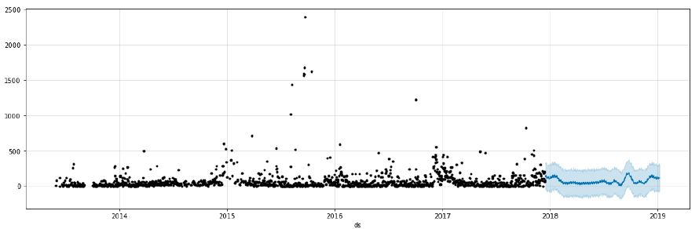
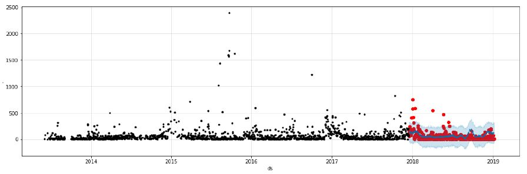

# Train-delay-analysis
## Abstract

Despite the fact that punctuality is an advantage of rail travel compared with other long-distance transport, train delays often occur. For this study,
a dataset of weather, train delay and train schedule records were collected and analyzed in order to understand the patterns of train 
delays and to predict train delay time. We found that in severe weather train delays are determined mainly by the type of bad weather, 
while in ordinary weather the delays are determined mainly by the historical delay time and delay frequency of trains. Identifying the factors 
closely correlated with train delays, we developed a machine-learning model to predict the delay time of each train at each station. The proposed prediction 
model is useful not only for passengers wishing to plan their journeys more reliably, but also for railway operators developing more efficient train schedules 
and more reasonable pricing plans.

## Scope and objectives

- To develop a methadology that can predict train delays.
- To select an appropriate Platform for implementing the code.
- Perform the exploratory analysis on the train delay data.

## Results
- Forecasted Data Points
 

- Forecasted Data Samples Overlapped over Original Samples

## Conclusion

In the study, we proposed a novel approach that sequentially concatenates a machine learning algorithm with a statistical model, i.e. PROPHET. This approach is able to consider both network-scale spatial-temporal correlations among traffic flows and location specific traffic characteristics. Its postprocessing by the ARIMA analysis can extract traffic features from the residuals of Neural Network, hence, significantly improve the accuracy of prediction. In addition, this approach is also able to capture the sharp nonlinearity of traffic flows. In the context of using seven years long railway traffic time series data set, the case study provides numerical evidence that the predictive capacity of the proposed prophet model. It is an effective and efficient tool for delay forecasting prediction. It is noteworthy that the MSE is significantly reduced in the comparison of ARIMA. It clearly reflects the important role of network-wide spatial correlations in traffic prediction. It is beneficial if the network traffic flows are treated as a whole in the prediction. The postprocess significantly improves the accuracy of delay prediction. In the future research, the proposed approach may be applied to traffic prediction for a large dataset over a wide range of trains if data is available. It may also be compared with those preprocess machine learning algorithms.

## Acknowledgment

